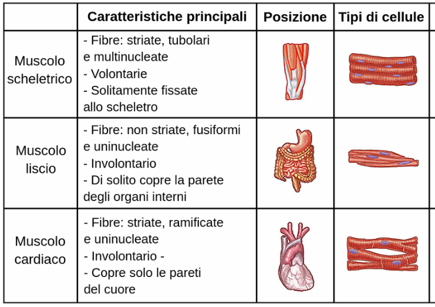
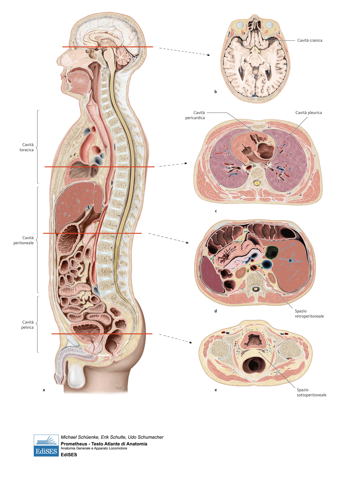
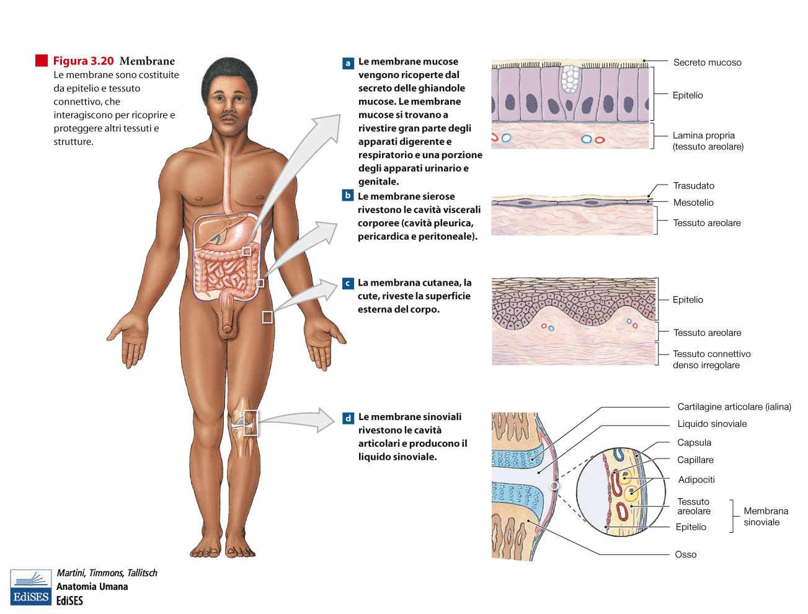

# Anatomia — Lezione 1: Introduzione al Corso

> **Argomento:** Presentazione del corso, docenti, materiali, definizioni di anatomia, approcci di studio, gerarchia strutturale, principio forma-funzione, tessuti, cavità corporee, piani di riferimento e terminologia
> **Blocchi presenti:** Informazioni sul corso · Presentazione docenti e programma · Organizzazione didattica e attività · Definizione e approcci · Gerarchia strutturale: dalla cellula all'organismo · Principio forma-funzione · Tipi di tessuto muscolare · Anatomia topografica e punti di repere · Rapporti topografici e principi di chirurgia · Imaging radiologico e convenzioni · Piani di sezione e convenzioni radiologiche · Suddivisione topografica del corpo · Rapporti tra organi e asimmetrie · Concetto di sezione trasversale · Sviluppo embriologico delle cavità · Suddivisione definitiva delle cavità · Membrane sierose: definizione e funzione generale · Membrane sierose specifiche e correlazioni cliniche · Cavità sierose (pericardio e pleura) · Logge anatomiche (esempio renale) · Fasce connettivali e peritoneo · Funzione del tessuto connettivo · Piani e terminologia anatomica · Piani di riferimento assoluti · Assi e direzioni · Anatomia di superficie e applicazioni cliniche

---

## Informazioni sul corso

### Struttura dell'esame
L'esame si chiama **Anatomia, Istologia ed Embriologia**. È composto da due parti:
1.  **Basi anatomiche** (anatomia sistematica e dell'apparato locomotore), gestita dal docente e dai suoi colleghi. Vale **9 CFU**.
2.  **Citologia, Embriologia e Istologia**, che fa parte di un altro esame (Istologia e Biologia). Vale **9 CFU**.

Per superare l'esame complessivo (che vale 18 CFU), è necessario:
*   Sostenere e superare **separatamente** le prove relative a ciascuna delle due parti.
*   Accettare entrambi i voti.
*   Ottenere la **media** dei due voti come voto finale.

### Modalità d'Esame
L'esame del primo anno è unico e comprende i moduli di **Anatomia** e **Istologia/Citologia**.
1.  **Prova scritta:** Consiste in un quiz di 30 domande a risposta multipla, da completare in 40 minuti. **Non ci sono penalizzazioni per le risposte sbagliate.**
2.  **Valutazione e accettazione del voto:**
    *   Dopo la prova, avete **5 giorni** per decidere se accettare o rifiutare il voto proposto.
    *   Se non si compie alcuna azione entro i 5 giorni, il sistema considera il voto come **accettato in via definitiva**.
    *   Il rifiuto è possibile senza conseguenze.
3.  **Voto finale:** Il voto finale dell'esame del primo anno è la **media ponderata** del voto di Anatomia e del voto di Istologia/Citologia.
4.  **Verbalizzazione:** **Non è automatica.** Dopo aver superato entrambe le parti (Anatomia e Istologia), è necessario iscriversi manualmente a un appello di **verbalizzazione**, dove il docente calcolerà e inserirà la media finale.
5.  **Validità:** I parziali di Anatomia **non scadono mai**, ma fino a quando non si è verbalizzato l'esame completo, il credito non viene acquisito.

### Materiali Didattici
*   **Testo di riferimento principale:** Prometheus (Atlante di Anatomia Umana). È composto da tre volumi:
    1.  **Volume 1:** Generalità e apparato locomotore.
    2.  **Volume 2:** Organi interni (addominali e toracici).
    3.  **Volume 3:** Sistema nervoso e organi di senso.
*   **Altri supporti:** Esistono risorse online accessibili tramite la biblioteca universitaria, contenenti immagini anatomiche identiche a quelle utilizzate a lezione.
*   **Consiglio sull'atlante:** L'atlante è utile per visualizzare e "aprire" le strutture, aiutando a farsi un'idea tridimensionale. Il Prometheus, per le sue dimensioni, è meno pratico da consultare rapidamente.

### Programma del Semestre
Il corso di questo semestre tratterà l'**Apparato Locomotore**.
*   **Esclusione:** Il cranio non sarà trattato in questa sede.
*   **Approccio:** L'insegnamento sarà di tipo **topografico**. Si studieranno le strutture che formano il corpo (muscoli, ossa) come "contenitori" per gli organi interni (es. gabbia toracica, scatola cranica).
*   **Integrazione con altre discipline:** Il docente fornirà cenni di embriologia (**organogenesi**) solo per spiegare l'origine e la disposizione di alcune strutture. Non saranno fatte domande specifiche di istologia, citologia o embriogenesi dettagliata.

### Modalità di studio e approccio
*   **Approccio progressivo:** Non si può sapere tutto da subito. Si comincia con una visione generale, che si arricchisce progressivamente fino alla discussione d'esame.
*   **Domande fondamentali:** Durante lo studio, porsi domande come: "Perché sta qui?", "Perché è fatto così?", "Con chi ha relazione?".
*   **Modalità di studio consigliata:** Il docente consiglia vivamente di **studiare in gruppo**. È impossibile memorizzare tutto in modo mnemonico; serve leggere, fare schemi, sottolineare e ripetere con qualcuno. Qualsiasi attività in più è un modo diverso per fissare i concetti.

### Logistica e Contatti
*   **Email del docente:** Gabriella.Gusella@...
*   **Richiesta:** Invece di inviare molte email individuali con la stessa domanda, il docente chiede di inviare domande collettive. Le risposte potranno essere condivise pubblicamente per creare un patrimonio comune.
*   **Aule:** Le aule sono collegate, ma non è possibile scambiare facilmente tra di esse. Si sta valutando la possibilità per il docente di spostarsi alla fine della lezione.
*   **Calendario:** È già noto.
*   **Iscrizione agli appelli:** È **obbligatoria**. Le scadenze sono di solito fissate 4-5 giorni prima della prova per permettere l'organizzazione logistica. Controllate sempre le date.
*   **Frequenza:** È richiesta una frequenza del 75% delle ore. Non è ancora chiaro cosa succeda se non si raggiunge il 65%, ma si stanno valutando azioni di recupero (es. tutor in sala anatomica). È fondamentale rispettare il monte ore complessivo richiesto dal corso di laurea (5.500 ore in 6 anni), altrimenti la laurea non è valida a livello europeo.
*   **Risorse disponibili:** Sono disponibili modelli anatomici in plastica (es. colonna vertebrale, ossa) e tour guidati con preparati tradizionali per lo studio in sala anatomica. L'Istituto possiede un Museo Anatomico con una collezione di preparati anatomici veri, realizzati tra la fine del Settecento e la metà dell'Ottocento. Ci si organizzerà per farvi visitare la collezione.
*   **Sede:** L'istituto di anatomia non si trova all'interno dell'ospedale mostrato, ma in un'area scientifica separata.
*   **Blocchi per esami successivi:** È probabile che per potersi iscrivere a Fisiologia (secondo anno) sia necessario aver superato Istologia e Citologia. Verificate il regolamento.
*   **Gestione personale:** Lo studio di Anatomia e Istologia insieme è consigliato, poiché i concetti sono complementari.
*   **Atteggiamento:** L'esame è una prova di valutazione. Si consiglia di affrontarlo con serenità, tentandolo anche se non ci si sente completamente sicuri, dato che non ci sono penalizzazioni.

> [!warning] Enfasi docente
> L'importante è avere una solida struttura, uno scheletro su cui costruire tutto il resto. La costruzione comincia quest'anno in modo massiccio e continuerà con tutti i corsi successivi. Lo scopo di questo corso è dare delle basi e delle indicazioni "geografiche" sul corpo umano.

---

## BLOCCO 1 — Presentazione Docenti e Programma

Il corso è tenuto da più docenti, scelti per competenze specifiche.

| DOCENTE | RUOLO / SPECIALITÀ | ARGOMENTO DI INSEGNAMENTO | ORE / CFU |
|---|---|---|---|
| **Gabriella Gusella** | Docente di Anatomia | Apparato locomotore (parte iniziale) e concetti generali | 20 ore (2 CFU) |
| **Prof. Micheletti** | Docente di Anatomia | Organi all'interno del torace e anatomia topografica | 5 CFU |
| **Prof. Canzi** | Clinico chirurgo (Otorino) | Topografia del collo (approccio clinico-chirurgico) | Non specificato |
| **Prof. Ciccarelli/Ceccarelli** | Associato | Argomento da definire (1 CFU) | 1 CFU |
| **Prof. Campi** | Non specificato | Una lezione | Non specificato |

**Note:**
*   Il docente principale (Gabriella Gusella) ha ceduto 10 ore del suo monte ore, portandolo da 30 a 20 ore. Questo comporterà una riprogrammazione del programma.
*   Il Prof. Canzi, essendo un chirurgo, è interessato non tanto a descrivere l'organo, ma a capire cosa succede quando si opera il collo e come si individuano le strutture (anatomia topografica).
*   Il programma (syllabus) viene presentato sei mesi prima dell'inizio dei corsi, quindi potrebbe non essere completamente definito all'inizio.

---

## BLOCCO 2 — Organizzazione Didattica e Attività

### Attività Frontali e Supplementari
*   **Totale ore frontali di anatomia:** 112 ore.
*   **Attività aggiuntive:** Sono previste altre attività (22.5 ore) che si stanno concordando. Data la difficoltà di incontrarsi tutti fisicamente, si terranno **incontri via Zoom** (es. Question Time) e altre attività come la creazione di un "gruppetto del Venerdì" per l'anatomia.
*   **Distribuzione temporale:** La parte riguardante il **tronco** e l'**apparato locomotore** verrà svolta quest'anno. Altre parti probabilmente saranno spostate al secondo semestre o all'anno successivo.

### Messaggio di Chiusura
Il docente conclude con un incoraggiamento: gli esami sono molti, ma si affrontano uno per volta. Prima degli studenti attuali, "ce l'ha fatta un sacco di gente". L'invito è a non andare nel panico e a procedere con gradualità.

---

## BLOCCO 3 — Definizione e Approcci

### Definizione di Anatomia

L'anatomia è lo studio della **forma del corpo umano**. Tuttavia, questa definizione non è esaustiva, poiché l'anatomia studia anche la **struttura** (come sono fatte le parti del corpo) e la **funzione** (a cosa servono).

> [!warning] Enfasi docente
> Il docente sottolinea che l'anatomia non è una materia puramente mnemonica. Sebbene ci sia molto da ricordare, è fondamentale **ragionare** sui concetti. Quando si affronteranno le discipline cliniche, si ricorderanno le cose su cui si è ragionato, non quelle memorizzate meccanicamente.

### Approcci allo Studio

Data la vastità della materia, esistono diversi approcci o classificazioni per studiare l'anatomia:
*   **Anatomia Sistematica (o Apparativa):** Studia il corpo per sistemi (es. sistema scheletrico, muscolare, nervoso) o apparati. Approfondisce come è fatto ogni singolo organo all'interno del suo apparato. È il fondamento necessario per approcci successivi.
*   **Anatomia Topografica (o Regionale):** Studia il corpo per distretti o regioni, analizzando tutte le strutture presenti in una determinata area. Risponde a domande come: "Se prendo una testa e la seziono, cosa ci trovo dentro?" (partendo dal cuoio capelluto, si trovano l'osso, le meningi, il tessuto nervoso, ecc.). **È l'approccio più utile per la pratica clinica e chirurgica**, poiché il medico deve sapere cosa c'è sotto la pelle in un punto specifico.
*   **Anatomia Macroscopica:** Studia le strutture visibili a occhio nudo.
*   **Anatomia Microscopica (Istologia):** Studia le strutture a livello cellulare e tissutale.
*   **Anatomia di Superficie (o Semiotica):** Studia i punti di riferimento sulla superficie del corpo (pelle, rilievi ossei) per dedurre e "vedere" le strutture sottostanti come se il corpo fosse trasparente. È fondamentale per la clinica e la chirurgia.

> [!warning] Enfasi docente
> È difficile approcciare lo studio topografico senza prima avere una solida conoscenza sistematica. I due approcci si integrano e si portano avanti insieme per anni durante la formazione.

### Principio fondamentale: La Forma è Funzione
*   Se una struttura non è fatta in un certo modo, non può funzionare in quel modo.
*   Dalla forma si possono comprendere le basi fisiopatologiche delle malattie.
*   **Esempi:**
    *   **Scoliosi:** Una forma anomala della colonna vertebrale ne compromette la funzione.
    *   **Cuore:** Se le quattro camere cardiache non sono costituite correttamente, ci saranno problemi alla circolazione sanguigna.

---

## BLOCCO 4 — Gerarchia strutturale: dalla cellula all'organismo

### Livelli di organizzazione
La struttura del corpo umano segue una gerarchia di complessità crescente:

1.  **Livello Molecolare/Cellulare (Citologia):**
    *   Si parte da atomi e molecole (nanometri) che formano proteine e strutture più grandi.
    *   Le cellule rappresentano l'unità fondamentale. Possono avere dimensioni variabili (es. un globulo rosso misura circa 8 micron).

2.  **Tessuto (Istologia):**
    *   **L'anatomia microscopica** si colloca a questo livello.
    *   Si formano quando **cellule con le stesse caratteristiche** si uniscono tra loro.
    *   Esistono diversi tipi di tessuti (es. muscolare, nervoso, connettivo).

3.  **Organo (Anatomia Microscopica d'Organo):**
    *   Si passa dall'istologia all'anatomia quando **diversi tipi di tessuto** si uniscono per formare un organo.
    *   **Esempio - Il Cuore:** Non è formato solo da cardiomiociti (tessuto muscolare). È composto anche da membrane (endocardio, pericardio), da uno scheletro fibroso e da tessuto di conduzione. Istologicamente sono tessuti diversi, che l'anatomia microscopica "monta insieme" per formare l'organo.

4.  **Apparato/Sistema:**
    *   Più organi che collaborano a una funzione comune formano un apparato (es. apparato cardiocircolatorio).

5.  **Organismo:**
    *   Il livello più alto di organizzazione, dove tutti gli apparati funzionano insieme.
    *   **Concetto chiave:** Gli apparati non funzionano in isolamento. L'organismo è un sistema integrato.
        *   L'apparato cardiocircolatorio non può funzionare senza l'apparato respiratorio che ossigena il sangue.
        *   Uno sbilanciamento nel funzionamento di un apparato può causare patologie sistemiche (es. un infarto, problema cardiaco, diventa un problema sistemico se il cuore pompa male e non arriva sangue al resto del corpo).

**Riepilogo rapido — Gerarchia strutturale:**
Molecole/Cellule (Citologia) → Tessuti omogenei (Istologia) → Organi (combinazione di tessuti) → Apparati (combinazione di organi) → Organismo (sistema integrato).

---

## BLOCCO 5 — Principio Forma-Funzione

Il principio fondamentale dell'anatomia è la stretta correlazione tra la **forma** di una struttura e la sua **funzione**. Questo concetto è applicabile a tutti i livelli, dalle articolazioni ai tessuti.

### Applicazione alle Articolazioni
La forma di un'articolazione determina il suo movimento:
*   Per un'articolazione che deve muoversi molto (es. coxo-femorale), la forma ideale è **sferica** (enartrosi), che permette movimenti ampi, incluso la circonduzione.
*   Se le superfici articolari fossero piatte e lisce, una di fronte all'altra, potrebbero solo **scivolare** l'una sull'altra.
> [!warning] Enfasi docente
> Non è necessario memorizzare ogni singola articolazione, ma imparare il **concetto fondamentale** di come classificare un'articolazione in base alla sua forma e alla funzione che ne deriva.

### Applicazione Generale
Questo principio spiega perché strutture diverse sono specializzate per compiti diversi. L'apparato cardiocircolatorio, ad esempio, non può funzionare se non funziona l'apparato respiratorio, e uno squilibrio tra i due può generare patologie sistemiche.

---

## BLOCCO 6 — Tipi di Tessuto Muscolare: Specializzazione Funzionale

Esistono tre tipi di tessuto muscolare, ciascuno specializzato per una funzione specifica. Tutti hanno la capacità di contrarsi, ma la loro organizzazione è ottimizzata per il compito.

### Descrittivo Parallelo

**Categorie condivise: Tipo · Controllo · Organizzazione · Funzione specifica**

---

**1. Muscolatura Scheletrica**
*   **Tipo:** Fibrocellule muscolari striate, lunghe.
*   **Controllo:** **Volontario**. Viene usata per i movimenti coscienti.
*   **Organizzazione:** Fibre parallele tra loro che uniscono due capi ossei.
*   **Funzione specifica:** Muovere le ossa. La contrazione avvicina o allontana i capi ossei.

---

**2. Muscolatura Liscia**
*   **Tipo:** Fibrocellule muscolari non striate.
*   **Controllo:** **Involontario**. Non si gestisce coscientemente (es. digestione).
*   **Organizzazione:** Disposta a formare la parete di organi cavi (tubo intestinale), con fibre longitudinali e circolari.
*   **Funzione specifica:** Svolgere movimenti propulsivi **direzionali** come la peristalsi. Normalmente spinge il contenuto in una sola direzione (es. dall'esofago verso l'ano). Il movimento inverso è patologico (es. in alcune occlusioni intestinali).

---

**3. Muscolatura Cardiaca**
*   **Tipo:** Cellule muscolari striate con caratteristiche peculiari.
*   **Controllo:** **Involontario**. Non si può decidere volontariamente la frequenza cardiaca.
*   **Organizzazione:** Fibre disposte in modo complesso (alcune circolari, altre longitudinali rispetto alle camere cardiache) che si inseriscono su un supporto scheletrico fibroso (lo "scheletro fibroso" del cuore, punto di appoggio per le valvole).
*   **Funzione specifica:** Fare da **pompa**. La contrazione deve essere **coordinata** e **sequenziale** (es. dal basso verso l'alto, dall'apice del ventricolo verso le valvole) per spingere efficacemente il sangue in una direzione. La perdita di questo coordinamento (es. fibrillazione ventricolare) fa sì che il cuore non pompi più.

> [!warning] Enfasi docente
> La specializzazione è fine: non si può usare lo stesso tipo di cellula per muovere un osso e per fare una pompa. Ogni cellula è ottimizzata per un solo compito. Il movimento, per essere efficace, deve sempre avere un **punto di inizio e un punto di fine** (un appoggio). Senza una direzione finalizzata, il movimento è inefficace (come spremere un tubetto di dentifricio dalla parte sbagliata).

---

*Confronto tra i tre tipi di tessuto muscolare: scheletrico, liscio e cardiaco, evidenziando differenze strutturali e funzionali.*

## BLOCCO 7 — Anatomia Topografica e Punti di Repere

L'anatomia topografica (o regionale) serve a sapere dove si trovano gli organi nel corpo (es. il fegato nella cavità addominale, sotto l'arcata costale destra).

La sua importanza clinica fondamentale risiede nell'uso dei **punti di repere**. Questi sono riferimenti superficiali, generalmente **sporgenze ossee** palpabili sotto la pelle, che permettono di orientarsi e localizzare strutture profonde senza dover esplorare casualmente tutto il corpo.

**Esempi clinici:**
*   La **fossetta del giugulo** (sopra lo sterno) e la regione **sotto-clavicolare** sono punti di repere per procedure come il cateterismo venoso centrale, per localizzare la vena succlavia o giugulare.
*   Usando punti di repere e convenzioni di linee immaginarie, si può delimitare la zona in cui ci si aspetta normalmente di trovare un organo (es. il fegato).
*   La **protuberanza occipitale esterna** dietro il collo (processo spinoso della vertebra cervicale C2), da cui si possono contare le altre vertebre.

> [!warning] Enfasi docente
> La conoscenza teorica della posizione degli organi deve essere adattata alla **costituzione fisica** dell'individuo (longilineo vs brevilineo/picnico). Un fegato può essere trovato leggermente più in basso in un soggetto brevilineo.

---

## BLOCCO 8 — Rapporti Topografici e Principi di Chirurgia

La topografia studia anche i **rapporti tra gli organi e le strutture**, sia esterne che interne. Questo è fondamentale perché:
1.  Una patologia può estendersi agli organi vicini.
2.  Un organo gonfio può comprimere le strutture adiacenti.

Questa conoscenza è indispensabile per la **semeiotica** e per la **chirurgia**, in particolare per la pianificazione delle **vie di accesso**.

**Principi delle vie di accesso chirurgiche:**
*   L'obiettivo è raggiungere la struttura da operare nel modo più diretto, tagliando il meno possibile e danneggiando il minimo le strutture circostanti.
*   Si scelgono approcci che rispettano l'architettura dei tessuti (es.: evitare di tagliare un muscolo trasversalmente alle sue fibre, perché il danno sarebbe maggiore).
*   Si deve conoscere l'anatomia per evitare strutture vascolari o nervose critiche (es.: l'arteria carotide durante un accesso alla tiroide).
*   Le **varianti anatomiche** rendono necessario, prima di un intervento, eseguire indagini radiografiche (TAC, risonanza magnetica, angiografie) per mappare con precisione il territorio, a volte "al millimetro".

> [!warning] Enfasi docente
> Prima dell'avvento di TAC e risonanza, il chirurgo spesso doveva "aprire ed esplorare" per capire l'anatomia del paziente. Oggi le indagini pre-operatorie riducono le sorprese.

---

## BLOCCO 9 — Imaging Radiologico e Convenzioni

### Principi della Radiografia Standard
*   **Convenzione cromatica:** I tessuti poco densi (come l'aria nei polmoni) appaiono **scuri/neri** sulla lastra, perché i raggi X li attraversano facilmente e impressionano (bruciano) l'emulsione fotografica.
*   I tessuti densi e radio-opachi (come l'osso) appaiono **bianchi**, perché i raggi X non li attraversano e non impressionano la lastra.
*   È l'**opposto di una fotografia** ottica normale.

**Cosa si valuta con una radiografia del torace (RX torace):**
*   Dimensioni dell'**ombra cardiaca** (o "silhouette cardiaca").
*   Presenza di fratture.
*   Asimmetrie.
*   Gli **archi cardiaci** (profilo del cuore visto in RX).

**Importanza della Tecnica:**
La qualità dell'immagine dipende dalla corretta esecuzione. Se il tubo radiogeno è troppo lontano, l'immagine sarà sfocata e ingrandita; se è troppo vicino, sarà ristretta. Il medico che richiede l'esame deve avere un occhio critico sulla tecnica utilizzata.

### Piani di Riferimento e Convenzioni Anatomiche
Per descrivere il corpo in modo univoco e interpretare le immagini, è necessario definire **assi e piani di riferimento**.

**Esempio pratico:**
*   Per visualizzare tutte le ossa del braccio senza sovrapposizioni, si posiziona il soggetto in **posizione anatomica classica** (in piedi, palmi delle mani in avanti).
*   Per studiare in dettaglio le ossa del polso, si eseguirà invece una **radiografia mirata** con specifici angoli di incidenza (assi).

> [!warning] Enfasi docente
> L'interpretazione di qualsiasi immagine (RX, TAC, RMN) deve sempre tenere conto di: **1)** la tecnica utilizzata, **2)** come era posizionato il paziente, **3)** i punti di riferimento anatomici.

### Applicazione Clinica: Semeiotica Cardiaca
La conoscenza topografica è cruciale per l'**auscultazione cardiaca**:
*   Il **soffio** prodotto da una valvola non si ascolta esattamente in corrispondenza della valvola stessa, ma **nella direzione in cui il getto sanguigno è diretto**.
*   Partendo da punti di repere superficiali (es.: spazio intercostale), si deve sapere dove localizzare l'itto cardiaco e dove aspettarsi di ascoltare i rumori delle diverse valvole.
*   Anche in questo caso, la costituzione fisica del paziente (longilineo vs brevilineo) influisce sulla posizione del cuore e quindi sui punti di ascolto.

---

## BLOCCO 10 — Piani di sezione e convenzioni radiologiche

### Descrittivo

In radiologia, i piani di sezione fondamentali (frontale, sagittale e trasversale) forniscono un riferimento assoluto. Tuttavia, per visualizzare specifiche strutture anatomiche che non sono allineate con questi piani standard, è necessario utilizzare piani di riferimento angolati.

**Esempio pratico:**
- Per studiare la **base cranica** in una proiezione laterale (sagittale), non si utilizza un piano trasversale semplice perché la base cranica è inclinata rispetto al terreno.
- Si impiega invece un piano di riferimento specifico, inclinato di un angolo definito (es. 19 gradi), che passa tra punti di repere cranici precisi (come il margine superiore dell'orbita e il meato acustico esterno). Questo permette di sezionare esattamente la regione di interesse.

> [!warning] Enfasi docente
> La corretta tecnica di esecuzione di un esame radiografico è fondamentale per una diagnosi accurata. Il medico che richiede l'esame deve avere un "occhio sulla tecnica" per valutare la qualità delle immagini prodotte.

**Tecnologie avanzate:**
- Con la **Tomografia Computerizzata (TC)** e la **Risonanza Magnetica (RM)**, la ricostruzione computerizzata dei dati permette di ottenere sezioni secondo qualsiasi piano desiderato in post-processing, superando i limiti dei piani di acquisizione fissi.

**Convenzioni di visualizzazione:**
- Esistono **convenzioni cliniche** standardizzate per la descrizione e la visualizzazione delle immagini.
- Ad esempio, nelle immagini di sezione trasversale (assiale), la convenzione è di guardare il paziente **dalla pianta dei piedi verso l'alto**. Queste convenzioni sono necessarie per una comunicazione univoca tra professionisti.

---

## BLOCCO 11 — Suddivisione topografica del corpo

### Descrittivo

Il corpo umano viene suddiviso in grandi regioni per facilitarne lo studio sistematico. La suddivisione fondamentale è:
1. **Testa** (o più precisamente **Cranio**)
2. **Tronco**
3. **Arti superiori**
4. **Arti inferiori**

**Approccio allo studio:**
Il docente propone un approccio che parte dal **tronco** come componente centrale, per poi aggiungere lo studio della testa e degli arti. Gli arti si attaccano al tronco attraverso strutture specializzate dette **cingoli**:
- **Cingolo scapolare** (per l'arto superiore)
- **Cingolo pelvico** (per l'arto inferiore)

### Suddivisione del tronco (in senso cranio-caudale):
1. **Testa/Cranio:** Poggia sul collo. Comprende:
   - **Neurocranio** (scatola cranica)
   - **Splancnocranio** [VERIFICARE: termine usato dal docente]
2. **Collo:** Sostenuto dalle sette vertebre cervicale.
3. **Torace:** Parte superiore del tronco.
4. **Addome:** Parte inferiore del tronco.
   - Il torace e l'addome sono separati dal **muscolo diaframma**.
5. **Pelvi/Piccola pelvi:** Una porzione inferiore in continuità con la cavità addominale.

**Cavità del tronco:**
- **Cavità addominale:** Occupata principalmente da organi dell'apparato digerente, reni e ureteri.
- **Cavità pelvica:** Più dedicata agli organi genitali e alla vescica.
- Insieme, formano la **cavità addomino-pelvica**.

---

## BLOCCO 12 — Rapporti tra organi e asimmetrie

### Descrittivo

L'analisi dei rapporti spaziali tra le strutture è fondamentale. Utilizzando sezioni secondo i piani fondamentali (sagittale, frontale, trasversale) è possibile visualizzare questi rapporti, similmente a quanto avviene con la Tomografia Computerizzata (TC).

**Esempi di rapporti visibili in sezione sagittale:**
- Il **cuore** è in posizione **ventrale** (anteriore) rispetto alla **colonna vertebrale**.
- La colonna vertebrale presenta posteriormente il **canale vertebrale** e i **processi spinosi**.
- Il **diaframma** separa il torace dall'addome; il **fegato** si trova immediatamente sotto di esso ed è in rapporto con la base del cuore.

**Asimmetrie corporee:**
- **Apparato locomotore (scheletro e muscoli):** È fondamentalmente **simmetrico** (speculare) tra destra e sinistra.
- **Organi interni:** Presentano spesso **asimmetrie**.
  - **Torace:** Contiene due polmoni (destro e sinistro) e il cuore in posizione centrale.
  - **Addome:** Gli organi non sono pari. Esempi:
    - **Fegato:** Uno solo.
    - **Intestino tenue:** Si ripiega su sé stesso formando una matassa.
    - **Colon:** Ha un decorso asimmetrico.
    - **Milza:** Presente solo a sinistra.

> [!warning] Enfasi docente
> La simmetria dell'apparato locomotore è una "buona notizia" per lo studio, in quanto riduce la quantità di strutture da memorizzare (una metà è il contralaterale dell'altra).

---

## BLOCCO 13 — Concetto di Sezione Trasversale e Cavità Corporee

Tagliando il corpo in modo trasversale a diversi livelli, si osservano strutture diverse:
- **Livello cranico:** cervello all'interno della scatola cranica.
- **Livello toracico:** cuore, polmoni e strutture muscolo-scheletriche del tronco.
- **Livello addominale:** fegato, colon, milza (a sinistra).
- **Livello pelvico:** articolazione dell'anca, vescica anteriormente, canale rettale.

Il **tronco** (capo, collo esclusi) contiene organi racchiusi in cavità:
- Cervello → cavità cranica (scatola cranica).
- Cuore e polmoni → cavità toracica (gabbia toracica).
- Organi intestinali → cavità addominale.

Queste cavità si formano insieme agli organi che le occupano, secondo un processo embriologico.

---

*Schema delle principali cavità corporee e della loro suddivisione topografica nel tronco.*

## BLOCCO 14 — Sviluppo Embriologico delle Cavità

### Concetto Embriologico di Base
L'embriologia spiega la formazione delle cavità e le possibili alterazioni neonatali (es. ernie). Le anomalie di sviluppo non sono casuali; per riconoscerle, bisogna conoscere lo sviluppo normale.

### Esempio Clinico: Ernia Ombelicale
Nel feto, la parete addominale anteriore inizialmente è aperta. Man mano che si sviluppa, questa parete cresce e racchiude l'intestino all'interno. Normalmente, rimane solo il cordone ombelicale, che viene tagliato alla nascita. In alcuni feti a termine, la parete non ha fatto in tempo a chiudersi completamente, e il contenuto intestinale fuoriesce dall'ombelico: questa condizione è l'**ernia ombelicale**.

### Processo di Formazione delle Cavità
In un embrione di circa due mesi (periodo in cui avviene la suddivisione dei tessuti), si riconoscono già le future cavità:
1.  **Cavità Cranica e Vertebrale:** Una "vescicola allungata" di tessuto nervoso (il futuro encefalo) si trova in uno spazio che diventerà la cavità cranica. Una struttura allungata a "serpentello" (il futuro midollo spinale) si troverà all'interno della futura colonna vertebrale. Questi spazi inizialmente vuoti si riempiranno di neuroni.
2.  **Diaframma e Suddivisione:** Nella "pancia" dell'embrione, compare precocemente una lamina muscolare disposta trasversalmente: il futuro **diaframma**. Esso divide:
    - Una cavità **antero-superiore**: il futuro torace.
    - Una cavità **postero-inferiore**: il futuro addome, inizialmente con poco contenuto perché l'intestino è ancora corto e deve svilupparsi.
3.  **Differenze di Sviluppo:**
    - La cavità toracica si **chiude subito**. I polmoni al suo interno sono poco sviluppati (non hanno respirato) e "collabiti".
    - La cavità addominale rimane **aperta più a lungo** per accogliere lo sviluppo dell'intestino, chiudendosi progressivamente verso l'ombelico.

> [!warning] Enfasi docente
> Le alterazioni dello sviluppo embrionale (es. ernia ombelicale, vescicole encefaliche esposte per mancata chiusura cranica) hanno una ragione d'essere e derivano dall'interruzione del normale processo formativo.

---

## BLOCCO 15 — Suddivisione Definitiva delle Cavità Corporee

Nell'adulto, le cavità derivano dalle conformazioni embrionali:
1.  **Cavità Cranica:** Contiene l'encefalo (cervello, cervelletto, tronco encefalico).
2.  **Cavità Vertebrale (Sudolare):** Prosegue dalla cranica e contiene il midollo spinale.
3.  **Cavità Toracica:** Delimitata inferiormente dal diaframma. Al suo interno contiene:
    - **Due cavità pleuriche** (che contengono i polmoni).
    - Il **mediastino**, uno spazio virtuale centrale che accoglie: grossi vasi, tiroide, trachea, esofago e, inferiormente, il cuore con il pericardio.
4.  **Cavità Addomino-Pelvica:** Suddivisa dal peritoneo in:
    - Una cavità di competenza del **peritoneo** (per gli organi che vi sono rivestiti).
    - Spazi **extraperitoneali** (retroperitoneali e sottoperitoneali) per organi come reni, ureteri, vescica, parte del retto e organi genitali.

---

## BLOCCO 16 — Membrane Sierose: Definizione e Funzione Generale

### Necessità Funzionale
Gli organi nelle cavità (cuore, polmoni, intestino) si muovono (es. polmoni si espandono, cuore pompa, intestino peristalsisce). Se non delimitati, questi movimenti causerebbero interferenze e traumi (es. cuore che "sbatte" contro i polmoni, intestino che si attorciglia). La soluzione è racchiuderli in "sacchetti" doppi: le **membrane sierose** (pleura, pericardio, peritoneo).

### Che cos'è una Sierosa?
Una membrana sierosa ha una struttura a doppio foglietto:
1.  **Strato di Base:** Tessuto fibroso consistente che forma la "capsula" (es. capsula della pleura).
2.  **Mesotelio:** Rivestimento di cellule molto appiattite (pavimentose) che secernono un **liquido sieroso**.

### Meccanismo Funzionale
Il liquido sieroso si accumula tra i due foglietti della membrana, creando una **cavità virtuale** piena di liquido. Questo permette ai due foglietti di scivolare l'uno sull'altro senza attrito.
- **Esempio (Pleura):** Un foglietto è fissato alla gabbia toracica, l'altro alla superficie del polmone. Quando la gabbia toracica si espande, la pressione non agisce direttamente sul tessuto polmonare, ma è mediata dallo scivolamento dei foglietti pleurici lubrificati dal liquido.
- **Vantaggio:** Consente movimenti fluidi e indipendenti degli organi, garantendo a ciascuno il proprio spazio funzionale.

---

*Schema delle membrane sierose (pleura, pericardio, peritoneo) che rivestono le cavità corporee e gli organi interni.*

## BLOCCO 17 — Membrane Sierose Specifiche e Correlazioni Cliniche

### 1. Pleura e Pericardio
- **Funzione:** Avvolgono rispettivamente polmoni e cuore, limitandone la posizione e permettendone il movimento senza interferenze.
- **Correlazione Clinica — Tamponamento Cardiaco:**
    - In caso di trauma toracico (es. impatto dello sterno sul volante), il cuore può lesionarsi e sanguinare.
    - Il sangue esce nel foglietto pericardico. Quando il cuore si contrae, il pericardio si riempie di sangue.
    - Se il pericardio è pieno di sangue, il cuore non riesce più ad espandersi adeguatamente durante la diastole: questa è la condizione di **tamponamento cardiaco**.
    - **Intervento:** È necessario drenare il sangue in eccesso (pericardiocentesi) per permettere al cuore di riprendere a funzionare.

### 2. Peritoneo
- **Funzione:** Nell'addome, contiene e permette il movimento dell'intestino, prevenendo torsioni (volvoli) che possono portare a infarto intestinale.

> [!warning] Enfasi docente
> Strutture normali e funzionali come le sierose possono, in condizioni traumatiche, diventare la base di problemi clinici gravi (es. il pericardio nel tamponamento). La conoscenza anatomica è fondamentale per intervenire e salvare il paziente.

**Riepilogo rapido — Membrane Sierose:**
- **Definizione:** Membrane a doppio foglietto (tessuto fibroso + mesotelio) che secernono liquido sieroso.
- **Funzione:** Delimitano organi mobili, creando una cavità virtuale lubrificata che permette movimenti fluidi senza attrito o interferenza.
- **Strutture:** Pleura (polmoni), Pericardio (cuore), Peritoneo (organi addominali).
- **Correlazione Clinica:** Il trauma può trasformare la loro funzione protettiva in un problema (es. tamponamento cardiaco da emopericardio).

---

## BLOCCO 18 — Cavità Sierose: Pericardio e Pleura

Le cavità sierose, rivestite da cellule chiamate **mesoteli**, compartimentalizzano le strutture interne (come polmone e cuore) e le mettono in condizione di lavorare senza interferenze. Sono costituite da un doppio strato.

### Pericardio

Il cuore è avvolto dal **pericardio**. Una parte esterna, il **pericardio fibroso**, è ancorata al diaframma. Questo ancoraggio impedisce al cuore di fare un movimento "a campana" durante la pulsazione, mantenendolo in posizione.

**Struttura a doppio foglietto:**
*   **Pericardio parietale:** Il foglietto esterno, che guarda verso il torace. È rivestito internamente da un epitelio (esotelio).
*   **Pericardio viscerale:** Il foglietto interno, attaccato direttamente alla superficie del cuore.
*   Tra i due foglietti c'è uno spazio minimo contenente un liquido sieroso. Questo permette ai foglietti di scivolare l'uno sull'altro durante il cambiamento di forma del cuore, senza attrito.

**Struttura della parete cardiaca (dall'esterno all'interno):**
1.  Pericardio viscerale.
2.  Miocardio (tessuto muscolare).
3.  Endocardio: un endotelio che riveste internamente il muscolo, impedendo al sangue di coagulare a contatto con la superficie muscolare.

La parte bassa del pericardio parietale è ancorata al diaframma. Il pericardio si riflette intorno ai grossi vasi di emergenza del cuore (grandi vasi della base).

> [!warning] Correlazione Clinica
> Se lo spazio pericardico, invece del liquido sieroso, comincia a contenere sangue (ad esempio per un trauma), si verifica un **tamponamento cardiaco**. Il sangue in eccesso comprime il cuore, impedendogli di riempirsi adeguatamente, e deve essere drenato.

### Pleura

Un concetto analogo si applica ai polmoni con lo **spazio pleurico**.
*   In condizioni normali, questo spazio contiene un liquido sieroso che permette lo scivolamento.
*   Se la parete toracica viene perforata, l'aria può entrare nello spazio pleurico (**pneumotorace**). L'aria occupa spazio, impedendo al polmone di espandersi durante l'inspirazione.
*   L'intervento d'emergenza (come mostrato nei film) consiste nel creare un drenaggio per far uscire l'aria e permettere al polmone di riespandersi.

---

## BLOCCO 19 — Logge Anatomiche: l'Esempio Renale

Oltre alle cavità sierose, il corpo utilizza le **logge** per contenere gli organi. Una logga è uno spazio dedicato delimitato da fasce connettivali.

### La Loggia Renale

I reni sono posizionati nella parete posteriore dell'addome. Il movimento dell'intestino potrebbe spostarli dalla loro posizione necessaria per il corretto drenaggio urinario.
*   La natura risolve questo problema con la **loggia renale**. Il rene non è "cucito" in posizione, ma è come se fosse infilato in una **tasca** (la loggia) formata da fasce connettivali. Sono le fasce (la tasca) ad essere ancorate alle strutture circostanti.
*   Questa tasca è riempita di **grasso** (grasso perirenale), che ammortizza e tiene fermo il rene senza dargli fastidio.

> [!warning] Correlazione Clinica
> In soggetti che dimagriscono eccessivamente, la perdita del grasso perirenale può far sì che il rene **scivoli verso il basso** (ptosi renale). Questo può favorire problemi come infezioni urinarie.

**Concetto generale:** Le logge sono nicchie delimitate da **fasce connettivali** (o "piaframmi connettivali") per contenere un organo in una posizione specifica e necessaria alla sua funzione.

---

## BLOCCO 20 — Fasce Connettivali e Peritoneo

### Il Ruolo del Tessuto Connettivo

Il tessuto connettivo, come suggerisce il nome, ha una doppia funzione: **connette** le strutture ma, al contempo, le **separa** e compartimentalizza.
*   Per contenere organi molli e delicati (come reni o intestino) senza strozzarli o bloccarli, si usano **capsule** (es. capsula renale) o **fasce** (lamine di tessuto connettivale più o meno denso).
*   Queste strutture si ancorano alle pareti del corpo (addome, torace) e consentono di formare le logge.

### Il Peritoneo e l'Intestino

L'intestino, pur essendo molto lungo, non è libero di essere "tirato fuori" in maniera disordinata.
*   È avvolto e ancorato alla parete posteriore dell'addome dal **peritoneo**. Questa membrana forma un **ventaglio di pieghe** che sostiene le anse intestinali.
*   Il peritoneo stabilisce delle pieghe che creano compartimenti, come lo spazio **retroperitoneale** e **sottoperitoneale**.
*   Organi come i **reni** e grossi vasi come l'**aorta** e la **vena cava** sono posizionati **retroperitonealmente**. È come se fossero appoggiati alla parete posteriore e poi il peritoneo (come un cartongesso) venga posto davanti a loro.

---

## BLOCCO 21 — Funzione del Tessuto Connettivo

Il tessuto connettivo è una struttura diffusa che permea tutto il corpo, agendo come un "incollo" che lega insieme tutte le parti. La sua funzione principale è **integrare il corpo in un tutt'uno**, garantendo coesione e continuità tra organi, muscoli, ossa e strati superficiali.

### Descrittivo — Ruoli e Adattabilità

*   **Funzione Integrativa:** Il connettivo passa all'interno degli organi, intorno agli organi e li collega tra loro. Questo fa sì che il corpo si comporti come un'unità; ad esempio, se si viene sollevati da un braccio, il braccio non si stacca.
*   **Adattabilità Strutturale:** È un tessuto estremamente eclettico che si modifica in base alla funzione richiesta:
    *   Per contenere strutture morbide (es. organi), diventa un connettivo lasso.
    *   Per formare tasche o guaine (es. intorno a un tendine), diventa più denso.
    *   Per creare legamenti, diventa molto solido e resistente.
*   **Creazione di Comparti:** Il connettivo organizza lo spazio, creando zone di rispetto e separazione. Ad esempio, nel peritoneo forma pieghe che delimitano spazi come il retroperitoneale (dove si trovano i reni e grossi vasi come l'aorta) e il sottoperitoneale (dove si trova la vescica). Questo è paragonabile a mettere un tubo contro un muro e poi chiuderlo con un cartongesso: il tubo diventa retrostante.
    *   Questa disposizione ha implicazioni pratiche, come la via di accesso chirurgico (es. l'accesso al rene è posteriore perché è retroperitoneale).
*   **Separazione e Scivolamento:** Crea piani di scivolamento che permettono a strutture vicine (es. muscoli) di contrarsi indipendentemente l'una dall'altra.
*   **Supporto e Passaggio:** Sostiene le singole cellule (es. nel sottocutaneo), crea membrane basali (es. per l'epidermide) e forma fasce (superficiali, profonde, sottosierose) che separano strati muscolari (es. nella parete toracica). Consente anche il passaggio e il sostegno di vasi sanguigni attraverso i fasci muscolari.
*   **Continuità Stratificata:** Crea una continuità tra tutti gli strati che costituiscono le pareti del corpo. Partendo dalla pelle, si passa al grasso sottocutaneo, che si fonde con i primi strati muscolari, per arrivare fino alle fasce interne (es. la fascia endotoracica). Anche l'osso è una forma specializzata di tessuto connettivo.

**Riepilogo rapido — Tessuto Connettivo:**
- Funzione: "incollo" corporeo che integra tutto in un tutt'uno.
- Proprietà: estremamente eclettico e adattabile (da lasso a solido).
- Ruoli: crea comparti (es. retroperitoneo), piani di scivolamento, fasce, sostiene cellule e vasi.
- Distribuzione: diffuso in tutto il corpo, dalla pelle all'osso.

---

## BLOCCO 22 — Piani e Terminologia Anatomica

Per descrivere la posizione delle strutture nel corpo, si utilizza un soggetto in una **posizione anatomica di riferimento** standard e una serie di piani e termini direzionali.

### Posizione Anatomica di Riferimento
Il soggetto è in piedi, di fronte all'osservatore, con:
- Braccia distese lungo i fianchi.
- Palmi delle mani rivolti in avanti (in supinazione).
Questa posizione permette di visualizzare chiaramente le strutture (es. radio e ulna non sono incrociati).

### Piani Anatomici
Immaginando di tagliare il corpo con diversi piani, si ottengono sezioni e termini direzionali specifici.

| PIANO | ORIENTAZIONE DEL TAGLIO | PARTI SEPARATE | TERMINI DIRETTIVI ASSOCIATI |
|---|---|---|---|
| **Sagittale (o Mediano)** | Taglio verticale che divide il corpo in destra e sinistra, passando idealmente per il naso. | Due metà simmetriche (destra e sinistra). | **Mediale:** verso il piano mediano. **Laterale:** lontano dal piano mediano. |
| **Frontale (o Coronale)** | Taglio verticale che divide il corpo in una metà anteriore e una posteriore. | Parte anteriore (ventrale) e posteriore (dorsale). | **Anteriore/Ventrale:** verso la parte frontale. **Posteriore/Dorsale:** verso la parte posteriore. |
| **Trasverso (o Orizzontale)** | Taglio orizzontale che divide il corpo in una parte superiore e una inferiore. | Parte craniale (superiore) e caudale (inferiore). | **Craniale/Superiore:** verso la testa. **Caudale/Inferiore:** verso i piedi. |

### Applicazione della Terminologia
I termini sono relativi e servono a descrivere la posizione di una struttura rispetto a un'altra.
- Esempio 1: "Il petto è mediale rispetto al braccio superiore, ma è laterale rispetto allo sterno".
- Esempio 2: "Il muscolo pettorale è caudale rispetto alla clavicola, ma è craniale rispetto all'addome".
- Per l'arto superiore si usano i termini **radiale** e **ulnare**.
- Per l'arto inferiore e la mano/piede si usano **tibiale/peroneale** e **palmare/plantare**.

**Riepilogo rapido — Terminologia:**
- Posizione di riferimento: in piedi, palmi in avanti.
- Piani: Sagittale (destra/sinistra → mediale/laterale), Frontale (anteriore/posteriore), Trasverso (superiore/inferiore → craniale/caudale).
- Termini: sono sempre relativi a una struttura di riferimento.

---

## BLOCCO 23 — Piani di Riferimento Assoluti

I piani di riferimento assoluti sono tre e dividono il corpo in metà speculari o distinte.

### Descrittivo parallelo

**Categorie condivise: Orientamento · Divisione corporea · Riferimento anatomico**

---

**1. Piano Sagittale**
*   **Orientamento:** Verticale, antero-posteriore.
*   **Divisione corporea:** Separa il corpo in una parte destra e una sinistra. È l'unico piano che produce due metà simmetriche (speculari).
*   **Riferimento anatomico:** Prende il nome dalla **sutura sagittale** del cranio, che unisce le due ossa parietali. Il piano sagittale è parallelo a questa sutura.

---

**2. Piano Frontale (o Coronale)**
*   **Orientamento:** Verticale, latero-laterale.
*   **Divisione corporea:** Separa il corpo in una porzione anteriore (ventrale) e una posteriore (dorsale).
*   **Riferimento anatomico:** Prende il nome dalla **sutura coronale** del cranio, che unisce l'osso frontale alle due ossa parietali. Il piano frontale è parallelo a questa sutura.

---

**3. Piano Trasverso**
*   **Orientamento:** Orizzontale.
*   **Divisione corporea:** Separa il corpo in una parte craniale (superiore) e una caudale (inferiore).

> [!warning] Enfasi docente
> I tre piani assoluti (sagittale, frontale, trasverso) sono fondamentali perché generano le divisioni di riferimento: destra/sinistra, sopra/sotto, avanti/dietro. Tutti gli altri piani (es. paramediani, paratrasversali) sono piani paralleli a questi tre di riferimento.

**Riepilogo rapido — Piani Assoluti:**
- **Sagittale:** Verticale antero-posteriore → destra/sinistra (simmetrico). Parallelo alla sutura sagittale.
- **Frontale/Coronale:** Verticale latero-laterale → anteriore/posteriore. Parallelo alla sutura coronale.
- **Trasverso:** Orizzontale → craniale/caudale.

---

## BLOCCO 24 — Assi e Direzioni di Movimento

I tre piani fondamentali si intersecano generando tre assi, utili per descrivere le direzioni di movimento.

### Descrittivo

*   **Asse Longitudinale:** È l'intersezione tra il piano sagittale e il piano frontale. È un perno verticale che passa attraverso il corpo dalla testa ai piedi. I movimenti che avvengono attorno a questo asse sono di tipo rotatorio.
*   **Asse Trasverso (o Orizzontale):** Passa da destra a sinistra. I movimenti di flessione ed estensione tipicamente avvengono attorno a questo asse.
*   **Asse Antero-posteriore (o Sagittale):** Passa dalla parte anteriore a quella posteriore. I movimenti di abduzione e adduzione avvengono attorno a questo asse.

**Terminologia direzionale basata sugli assi:**
*   **Direzione Latero-laterale:** Movimento che inizia da un lato e si sposta verso l'altro.
*   **Direzione Dorso-ventrale:** Movimento dalla schiena verso la pancia o viceversa.
*   **Direzione Cranio-caudale:** Movimento dalla testa verso i piedi. Il movimento contrario è **caudio-craniale**.

> [!warning] Enfasi docente
> Questa terminologia (craniale/caudale, mediale/laterale, ventrale/dorsale) sostituisce il linguaggio comune ("sopra/sotto, destra/sinistra") e costituisce il linguaggio tecnico della medicina. Va usata per descrivere i rapporti tra gli organi.

**Terminologia regionale specifica:**
*   Sul braccio, si usa **radiale** (lato del radio, parte esterna) e **ulnare** (lato dell'ulna).

**Riepilogo rapido — Assi e Direzioni:**
- **Assi:** Longitudinale (sagittale ∩ frontale) · Trasverso (destra-sinistra) · Antero-posteriore (avanti-dietro).
- **Direzioni:** Latero-laterale · Dorso-ventrale · Cranio-caudale/Caudio-craniale.
- **Sul braccio:** Radiale (esterno) / Ulnare (interno).

---

## BLOCCO 25 — Anatomia di Superficie e Applicazioni Cliniche

L'osservazione dell'anatomia di superficie fornisce informazioni cliniche immediate sulla postura e sullo stato di salute.

### Valutazione Posturale

Una valutazione posturale di base si effettua osservando il paziente di fronte e di lato, allineandolo a un asse verticale ideale (che coincide con la linea del baricentro, ovvero la linea di punti equidistanti da tutti i punti del piano corporeo).

**Allineamento posturale corretto (vista laterale):** La linea verticale di riferimento deve passare per:
1.  Il meato acustico esterno.
2.  Il passaggio tra le vertebre cervicali e toraciche.
3.  Il punto in cui le vertebre toraciche diventano lombari.
4.  Il baricentro del corpo.
5.  Il baricentro del piede.
6.  L'articolazione coxo-femorale (centro dell'anca).
7.  Il centro del ginocchio.
8.  Il centro della caviglia.

> [!warning] Enfasi docente
> Un soggetto con questo allineamento ha una postura perfetta, traguardabile a occhio. Una deviazione indica un problema a livello del piede, del ginocchio, dell'anca o della colonna vertebrale, che formano una catena articolare.

**Osservazioni cliniche dai piani:**
*   **Piano frontale:** Può rivelare un ginocchio **valgo** ("gambe a X") o **varo** ("gambe da fantino"), con possibili compensi a livello della colonna (es. scoliosi).
*   **Piano sagittale:** Può mostrare un ginocchio iperesteso ("ginocchio recurvato") o un ginocchio che non riesce a estendersi completamente. Queste osservazioni possono dare indicazioni sullo stato dei legamenti.

### Punti di Repere e Linee di Superficie

*   I rilievi ossei visibili o palpabili sotto la pelle sono **punti di repere**. Hanno un nome specifico in semeiotica clinica e servono per localizzare strutture più profonde (organi, vasi) che non sono palpabili a causa dello scheletro.
*   La superficie del corpo è suddivisa in zone topografiche precise da **linee di riferimento** (es. linee sul torace). Questa denominazione precisa va riportata nella cartella clinica per descrivere la localizzazione di segni (es. eruzioni cutanee, edemi).
*   **Esempio di punto di repere:** Posteriormente, a livello della regione lombare, si osservano due fossette simmetriche. Questo è il punto dove l'anca si articola con l'osso sacro. La pelle è molto aderente all'osso in quel punto perché c'è poca massa muscolare e un grosso legamento sottostante.

### Cenni Storici: La Pelvimetria

*   Le fossette lombari sopra descritte delimitano la **losanga di Michaelis** (o losanga di Chaussier).
*   In passato, prima dell'avvento della radiologia e dell'ecografia, le dimensioni di questa losanga venivano usate per una **pelvimetria** approssimativa. Serviva a predire se il bacino di una donna fosse sufficientemente ampio per consentire il passaggio del feto durante il parto.
*   Storicamente, la conformazione fisica (fianchi larghi) era inconsciamente associata a una maggiore probabilità di sopravvivenza al parto, in un'epoca in cui la mortalità materna era molto alta.

---

## APPENDICE TABELLARE

*Riepilogo aggregato della lezione per ripasso rapido.*

### Definizioni

| CONCETTO | DEFINIZIONE | NOTE |
|---|---|---|
| Anatomia | Studio della forma, struttura e funzione del corpo umano. | Non è puramente mnemonica, richiede ragionamento. |

### Approcci Anatomici

| APPROCCIO | OGGETTO DI STUDIO | ESEMPI | UTILITÀ PRATICA |
|---|---|---|---|
| Sistematico | Sistemi/Apparati corporei | Apparato scheletrico, muscolare | Fondamento per la conoscenza di base |
| Topografico (Regionale) | Distretti/Regioni corporee | Cosa c'è nella testa? | Chirurgia, clinica, localizzazione |
| Macroscopico | Strutture visibili a occhio nudo | Ossa, muscoli, organi | Osservazione generale |
| Microscopico (Istologia) | Strutture a livello cellulare/tissutale | Tessuti, cellule | |
| Di Superficie (Semiotica) | Repere strutture sottostanti tramite punti cutanei | Palpazione di un margine costale | Diagnosi, intervento senza visione diretta |

### Gerarchia Strutturale

| LIVELLO | COMPOSIZIONE | ESEMPIO |
|---|---|---|
| Molecolare/Cellulare (Citologia) | Atomi, molecole, cellule | Globulo rosso (~8 micron) |
| Tissutale (Istologia) | Cellule con caratteristiche simili | Tessuto muscolare, nervoso, connettivo |
| D'Organo | Diversi tipi di tessuto combinati | Cuore (miocardio + membrane + scheletro fibroso) |
| D'Apparato/Sistema | Più organi con funzione comune | Apparato cardiocircolatorio |
| Organismo | Tutti gli apparati integrati | |

### Tessuto Muscolare

| TIPO | CONTROLLO | ORGANIZZAZIONE | FUNZIONE SPECIFICA | ESEMPIO/PATOLOGIA |
|---|---|---|---|---|
| **Scheletrico** | Volontario | Fibre parallele tra capi ossei | Muovere le ossa | Movimenti volontari |
| **Liscio** | Involontario | Fibre longitudinali/circolari in pareti di organi | Propulsione direzionale (peristalsi) | Digestione; Occlusione intestinale (movimento inverso) |
| **Cardiaco** | Involontario | Fibre complesse inserite su scheletro fibroso cardiaco | Pompa sanguigna coordinata | Fibrillazione ventricolare (perdita di coordinamento) |

### Cavità Corporee (Sviluppo e Adulto)

| CAVITÀ | SEDE EMBRIONALE | CONTENUTO NELL'ADULTO | NOTE SVILUPPO |
|---|---|---|---|
| Cranica | Vescicola nervosa allungata | Encefalo (cervello, cervelletto, tronco encefalico) | Si chiude intorno al tessuto nervoso |
| Vertebrale | Struttura a "serpentello" | Midollo spinale | Prosegue dalla cavità cranica |
| Toracica | Antero-superiore al diaframma embrionale | Cavità pleuriche (polmoni) + Mediastino (cuore, grossi vasi, ecc.) | Si chiude precocemente; polmoni inizialmente collabiti |
| Addomino-pelvica | Postero-inferiore al diaframma embrionale | Organi digestivi + organi extraperitoneali (reni, vescica, ecc.) | Rimane aperta più a lungo per sviluppo intestino |

### Membrane Sierose

| MEMBRANA | ORGANI RIVESTITI | FUNZIONE PRINCIPALE | STRUTTURA | CORRELAZIONE CLINICA |
|---|---|---|---|---|
| Pleura | Polmoni | Permettere espansione/compressione polmonare senza attrito | Doppio foglietto con liquido pleurico | Pneumotorace (accumulo di aria) |
| Pericardio | Cuore | Permettere movimenti di pompa cardiaca senza interferenze | Doppio foglietto con liquido pericardico | Tamponamento cardiaco da emopericardio post-traumatico |
| Peritoneo | Organi addominali (es. intestino) | Contenere e permettere peristalsi senza torsioni | Doppio foglietto con liquido peritoneale | Prevenzione di volvolo/infarto intestinale |

### Logge/Fasce

| STRUTTURA | ORGANO CONTENUTO | DESCRIZIONE | FUNZIONE | CORRELAZIONE CLINICA |
|---|---|---|---|---|
| Loggia Renale | Rene | Tasca formata da fasce connettivali, riempita di grasso | Contenere e stabilizzare il rene | Ptosi renale in caso di perdita del grasso perirenale |
| Fasce Connettivali / Capsule | Vari organi molli | Lamine di tessuto connettivale | Contenere organi senza strozzarli, formare logge | — |

### Funzioni del Tessuto Connettivo

| FUNZIONE | DESCRIZIONE | ESEMPIO |
|---|---|---|
| Integrazione corporea | Lega tutte le parti del corpo in un tutt'uno. | Impedisce che un arto si stacchi se sollevato. |
| Adattamento strutturale | Modifica densità e resistenza in base alla necessità. | Da lasso (organi) a solido (legamenti). |
| Creazione di comparti | Delimita spazi attraverso pieghe e fasce. | Forma il retroperitoneo e il sottoperitoneo. |
| Separazione e scivolamento | Crea piani che permettono movimenti indipendenti. | Separa strati muscolari contigui. |
| Supporto e conduzione | Sostiene cellule e permette il passaggio di vasi. | Fasce che guidano vasi attraverso i muscoli. |

### Suddivisione Topografica del Corpo

| REGIONE | SOTTODIVISIONI PRINCIPALI | PUNTI DI RIFERIMENTO/CONFINI |
|---|---|---|
| **Testa (Cranio)** | Neurocranio · Splancnocranio | Poggia sul collo |
| **Collo** | | Sostenuto da 7 vertebre cervicali |
| **Tronco** | Torace · Addome · Pelvi | Separato da diaframma (torace/addome) - Cavità: addomino-pelvica |
| **Arti Superiori** | | Attaccati al tronco via **Cingolo scapolare** |
| **Arti Inferiori** | | Attaccati al tronco via **Cingolo pelvico** |

### Piani di Sezione e Convenzioni

| PIANO | SINONIMO | DIVISIONE | TERMINI DIRETTIVI PRIMARI |
|---|---|---|---|
| Sagittale/Mediano | - | Destra/Sinistra | Mediale, Laterale |
| Frontale | Coronale | Anteriore/Posteriore | Ventrale/Anteriore, Dorsale/Posteriore |
| Trasverso | Orizzontale | Superiore/Inferiore | Craniale/Superiore, Caudale/Inferiore |

### Asimmetrie degli Organi Interni

| ORGANO/SISTEMA | SIMMETRIA | NOTE |
|---|---|---|
| **Apparato Locomotore** | Simmetrico (speculare) | |
| **Polmoni** | Simmetrici (destro/sinistro) | |
| **Cuore** | Asimmetrico (posizione centrale) | |
| **Fegato** | Asimmetrico (uno solo) | |
| **Intestino Tenue** | Asimmetrico (matassa) | |
| **Colon** | Asimmetrico (decorso) | |
| **Milza** | Asimmetrico (solo sinistra) | |

### Concetti Chiave Topografici e Radiologici

| CONCETTO | DEFINIZIONE | APPLICAZIONE/ESEMPIO | IMPORTANZA |
|---|---|---|---|
| **Anatomia Topografica** | Studio della posizione degli organi nelle diverse regioni. | Localizzare il fegato nell'ipocondrio destro. | Base per l'esame obiettivo e la semeiotica. |
| **Punti di Repere** | Sporgenze ossee o strutture palpabili usate come riferimento. | Fossetta del giugulo, clavicola. | Permettono di localizzare strutture profonde senza esplorare tutto il corpo. |
| **Rapporti Topografici** | Relazioni di vicinanza tra organi e strutture. | Fegato ingrossato che comprime organi vicini. | Fondamentale per capire l'estensione delle patologie e per la chirurgia. |
| **Via di Accesso Chirurgica** | Percorso per raggiungere una struttura da operare. | Sternotomia vs toracotomia costale per il cuore. | Deve minimizzare il danno ed evitare strutture critiche. |
| **Convenzione Radiografica** | Rapporto tra densità del tessuto e colore. | Osso = bianco; Aria (polmoni) = nero. | Permette l'interpretazione corretta delle immagini. |
| **Posizione Anatomica** | Posizione standard di riferimento: in piedi, palmi in avanti. | Base per descrivere assi, piani e per eseguire RX. | Garantisce un linguaggio comune e riproducibile. |

---

*Fine sbobina — Lezione 1*
*Argomenti correlati: → Apparato locomotore · → Anatomia topografica del torace · → Anatomia topografica del collo · → Terminologia anatomica · → Piani e assi del corpo · → Citologia · → Istologia (tessuti) · → Anatomia sistematica · → Articolazioni · → Cuore · → Apparato digerente · → Osteologia · → Artrologia · → Miologia · → Semeiotica dell'addome · → Arti superiori · → Arti inferiori · → Cavità corporee · → Embriologia del tubo digerente · → Anatomia topografica dell'addome · → Sistema urinario · → Struttura microscopica del connettivo · → Fasce e aponeurosi · → Semeiotica dell'apparato locomotore*